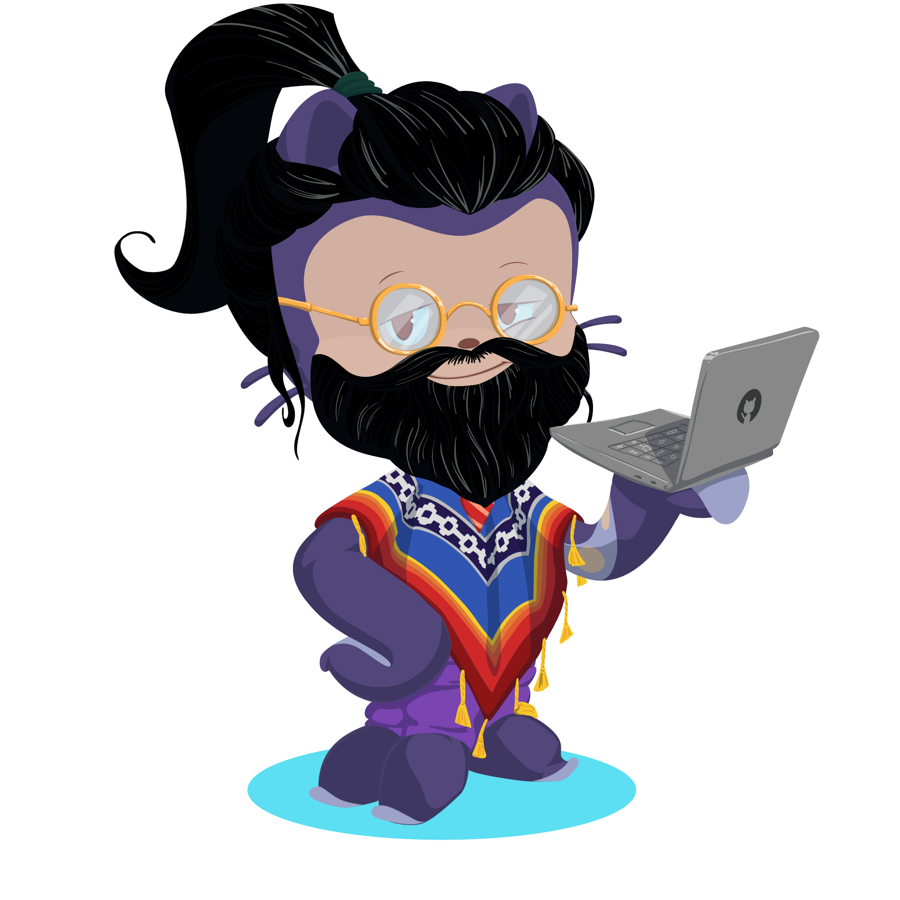

  <h2> Olá, sou o Lucas!</h2>
  

Desenvolvedor Front-End apaixonado por Vue.js e com hobby em Node.

Entusiasta em estudos de Acessibilidade, UX e UI para usuários, otimização de SEO e desevolvimento Mobile First.

&nbsp;

  <a href="https://github.com/lucaspmarra">
  

  

 
  
  
  
  
  
  
  

  
  

 
 
  
 
  
  

&nbsp;

Hard skills

- Conhecimento em <i>try/catch</i> para tratamento de erros.
- Conhecimento em <i>ascyn/await</i>.
- Tratamento de array.
- Conceitos básicos.
- Manipulação do DOM.
- Funções.

&nbsp;

- Conhecimento nas stacks:
  - vue-router
  - axios
  - pinia
  - composition api
  - options api
- Desenvolvimento de páginas para consultas de dados internos.
- Desenvolvimento de Hotsites:
  - [TRE-GO - Central de Sistemas](https://apps.tre-go.jus.br/central-de-sistemas/)
  - [TRE-GO - Central de Indicadores](https://apps.tre-go.jus.br/central-de-indicadores/#/)
  - [TRE-GO - Contato Zonas Eleitorais](http://intranet.tre-go.jus.br/contato-zonas/)

&nbsp;

- Desenvolvimento e utilização de Proxy Server utilizando Node.js para bypass de CORS.

&nbsp;

- Desenvolvimento de REST API's diversas.

&nbsp;

- Desenvolvimento de SPA utilizando Nuxt 2, consumindo um servidor de REST API criado em Node.js (tópico acima).
- Desenvolvimento de Hotsites:
  - [TRE-GO - Espaço Bem Cuidar](https://apps.tre-go.jus.br/seats-bem-cuidar/)
- Desenvolvimento de Client para Headless CMS Contentful.

&nbsp;

- Conhecimentos básicos de projeto e estrutura de projeto.
- Criação de REST API.

&nbsp;  

  
  
  
  
  
  
  
  
  

&nbsp;  

Estatísticas

 

 

<!-- Proudly created with GPRM ( https://gprm.itsvg.in ) -->

&nbsp;  

Resumo Profissional

- Graduação em Análise e Desenvolvimento de Sistemas no UniCEUB, com participação no desenvolvimento do Front-End do [Centro de Atendimento Comunitário do CEUB](https://laboratorio.uniceub.br/Home/Index), utilizando as tecnologias HTML, CSS e Javascript;

- Atualmente alocado na Seção de Suporte aos Sistemas Corporativos (SESCO) do Tribunal Regional Eleitoral de Goiás, com atividades de Desenvolvimento, Sustentação, Manutenção de Sistemas Legados e Suporte aos usuários. Com passagem pela TOTVS como Analista de Implantação do ERP Protheus e Analista de Suporte N1 na PAVO Tecnologia;  

- Desenvolvimento de Microfrontends, Front-End e Hotsites utilizando Angular.js, Vue.js, Nuxt e Quasar;  
- Desenvolvimento de Rest API's utilizando Node.js, Express, Raw Query's, Java e Springboot;  
- Conhecimento em Banco de Dados Oracle, MySql e PostgreSQL;  
- Experiência em ERP Protheus da TOTVS, implantação e sustentação nos módulos SIGACOM, SIGAFAT, SIGAFIN, SIGAEST, SIGACFG e ASPDU;  
- Experiência em Suporte aos Usuários como N1 e N3;  
- Experiência em SEO, Google Search Console e Google Analytics;  
- Certificado SCRUM Foundation e DevOps Foundation;  

- Microfrontend e Hotsites desenvolvidos com Vue.js para o Tribunal Regional Eleitoral de Goiás:  
  - [Central de Sistemas](https://apps.tre-go.jus.br/central-de-sistemas/);  
  - [Contato Cartórios do Estado de Goiás](https://apps.tre-go.jus.br/internet/contato-zonas/);  
  - [Central de Indicadores Corregedoria](https://apps.tre-go.jus.br/central-de-indicadores/#/);  

REFERÊNCIAS:

- Sérgio Cozzetti Bertoldi de Souza - Gerente de Desenvolvimento de Software no UniCEUB;  
- Alexandre Einstein Barcelos Cunha - Analista Desenvolvedor no TRE-GO;  
- Ramon de Freitas Elias Campos - Assessoria PJe no TRE-GO;  

&nbsp;

Resumo acadêmico

Na carreira estudantil, participei de um projeto para a construção de um sistema que facilitasse o agendamento de exames para as famílias carentes e de baixo acesso ao centro da cidade, facilitando que elas conseguissem marcar seu exame na Clínica Médica do UniCEUB pela internet.
Neste projeto atuei como desenvolvedor Front-End, buscando a acessibilidade de todos os usuários, mantendo a facilidade de acesso e leitura da interface.
Pode ser conferido na url: [Laboratório UniCEUB](https://laboratorio.uniceub.br/)

##### Badge reference: <https://github.com/Ileriayo/markdown-badges>
